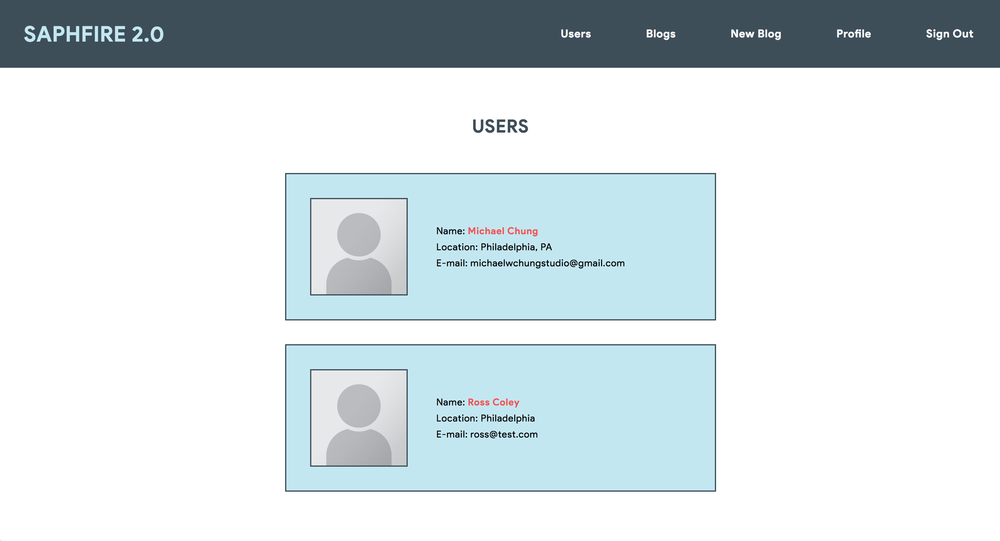
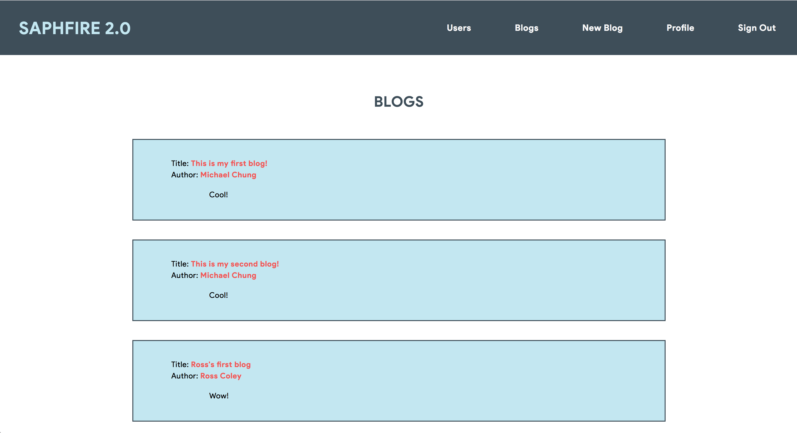
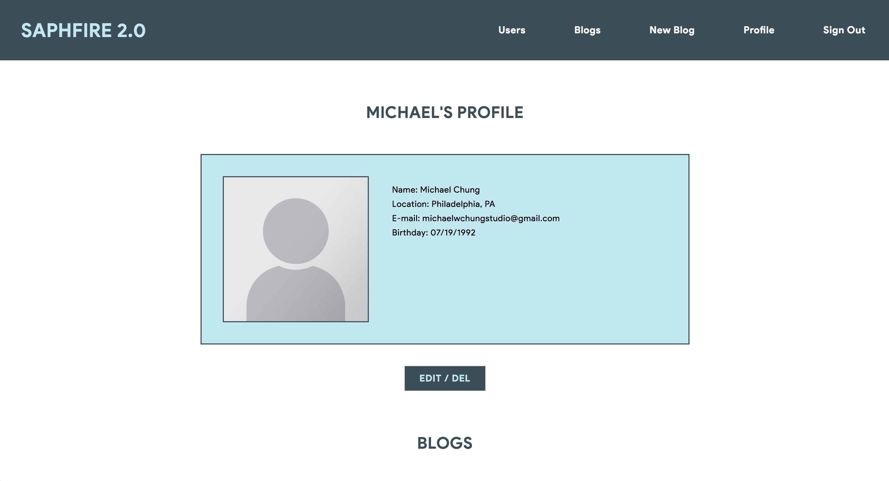
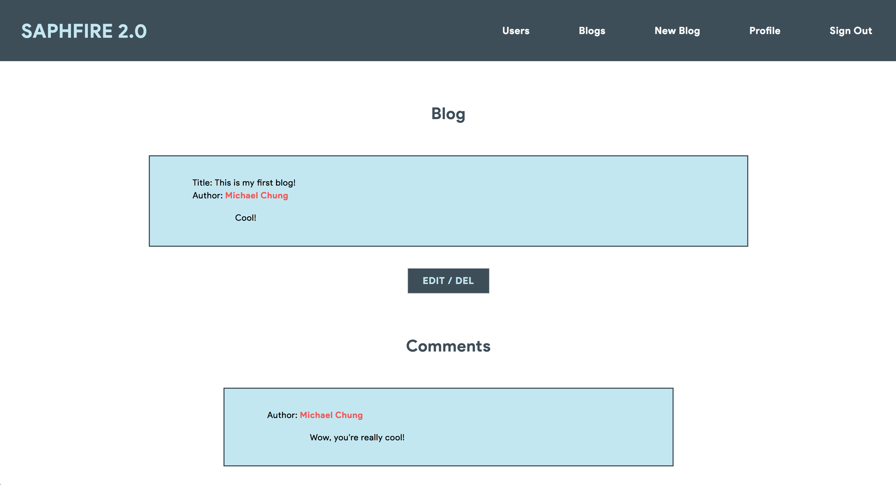

# Saphire 2.0

Full-stack application that allows users to create, view, and share custom blog posts.

## How To Use

If cloning the repository:

1. Open terminal and navigate to the project folder.
2. Execute 'bundle install' in order to install gems.
3. Execute 'rails db:migrate' to create the database.
4. Start the server with 'rails s' command.
5. Open browser window with correct port (ex. localhost:3000).

If using the hosted Heroku application:

Any visitor may view the list of users, their profiles, or list of blogs. Registration is required in order to make blog posts or comment on other blog posts.

List of users:

List of blogs:

User profiles will have that user's sign up information listed (name, location, e-mail, and birthday). Blog posts are listed below and comments on blogs are listed below the blogs. In order to make edits to information, blog content, or comment content, that specific user must be signed in. Links are in red and allow users to easily access blogs from either blog lists or even comment lists.

User profile:

Blog page w/ comments:

## Future Improvements / Bug Fixes

 - add brief biography field for users, hide more sensitive information (ex. birthday and e-mail). Provide users options to show or hide that information.
 - more fluid UI/UX design, most notably the buttons to edit/delete information, blogs, or comments (placement below is not ideal and becomes cluttered when there are more blogs and comments)
 - add limits to showing a certain number of blog posts (provide users the ability to select through pages or possibly even search for specific blog posts by name or date posted)

## Built With

* HTML
* CSS / SASS
* Ruby (version 2.5.1)
* Rails (version 5.2.1)
* [Devise](https://github.com/plataformatec/devise) gem

## Authors

* **Michael Chung**

## Acknowledgments

* Oggi Danailov
* New York Code & Design Academy
* StackOverflow
